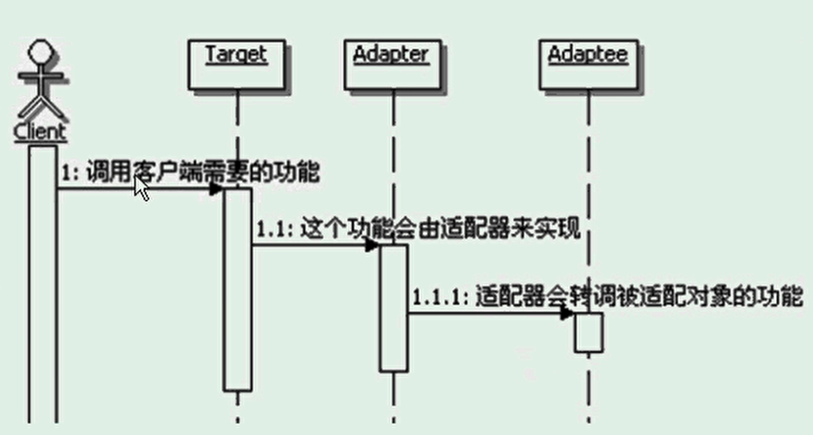

# 适配器模式
```
定义：
    将一个类的接口转换成客户希望的另一个接口。
    适配器模式使得原本由于接口不能兼容而不能一起工作的那些类可以一起工作。
    
使用实例：
    同时支持数据库和文件的日志管理
    
适配器模式的主要功能：
    进行转换匹配，目的是复用已有的功能，而不是来实现新的接口
    适配器里面也可能实现功能，称这种适配器为智能适配器······
被适配对象和适配称为的对象是没有关联的
适配器的实现方式其实是依靠对象组合。

流程示意图：
    

适配器通常是一个类，一般会让适配器类去锁骨下班Target接口，然后在适配器的具体实现里面调用Adaptee
可以在适配器的实现里面，加入新功能的实现，这种适配器被称为智能适配器
可适配多个Adaptee
适配器Adapter实现的复杂程度，取决于Target和Adaptee的相似程度
缺省适配：为一个接口提供缺省实现。创建一个缺省适配器类，让适配器继承。适配器只需按需求重写或者不写即可使用。

双向适配器：
    把Adtatee适配称为Target，也可以把Target适配称为Adtaptee。

```

## 对象适配器和类适配器
```
对象适配器的实现:依赖于对象组合。
类适配器的实现：采用多重继承对一个接口与另一个接口进行匹配。但Java不支持多重继承，所以未涉及。

1、从实现上：类适配器使用对象继承的方式，是静态的定义方式；而对象适配器使用对象组合的方式，是动态组合的方式
2、对于类适配器：由于适配器直接继承了Adaptee，是的适配器不能和Adaptee的子类一起工作，因为继承是个静态的关系，
当适配器继承了Adaptee过后就不能再去处理Adaptee的子类了。
   对于对象适配器：允许一个Adapter和多个Adaptee,包括Adaptee和它所有的子类以前工作。
   因为对象适配器采用的是对象组合的关系，只要对象类型正确，是不是子类都无所谓。
3、对于类适配器：适配器可以重定义Adaptee的部分行为，相当于子类覆盖父类的部分实现方法。
    对于对象适配器：要重定义Adaptee的行为比较困难，这种情况下，需要Adaptee的子类来实现重定义，然后让适配器组合子类。
4、对于类适配器，仅仅引入一个对象，并不需要额外的引用来间接得到Adaptee。
    对于对象适配器，需要额外的引用来间接得到Adaptee。
```

##适配器模式的优缺点
```
更好的复用性
更好的可拓展性
过多的使用适配器，会让系统非常凌乱，不容易整体进行把握
```

## 适配器模式的思考
```
适配器模式的本质：转换匹配，复用功能

何时选用适配器模式：
    如果你想要使用一个已经存在的类，但是它的接口不符合你的需求，这种情况可以使用适配器模式，来把已有的实现转换成你想要的接口。
    如果你想创建一个可以复用的类，这个类可能和一些不兼容的类一起工作，这种情况可以使用适配器模式，到时候想要什么就适配什么
    如果你想使用一些已经存在的子类，但是不可能对每一个子类都进行适配，这种情况可以选用对象适配器，直接适配这些子类的父类就可以了。 
```


