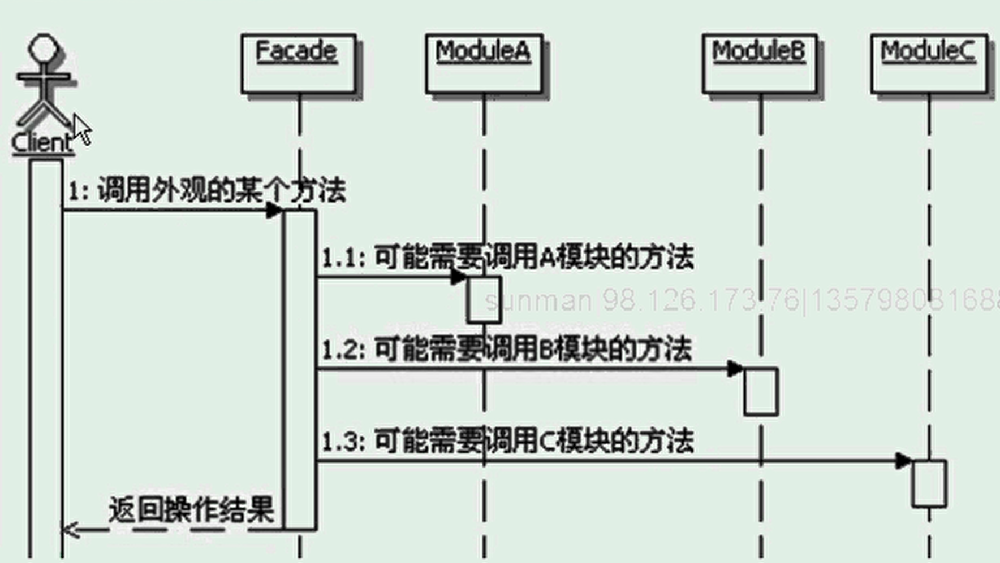

# 外观模式
```
定义：
    为子系统中的一组接口提供一个一致的界面，
    Facade模式定义了一个高层接口，这个接口使得子系统更加容易使用.

Facade:定义子系统的多个模块对外的高层接口，通常需要调用内部多个模块，从而把客户的请求代理给适当的子系统对象。
模块：接受Facade对象的委派，真正实现功能，各个模块之间可能有交互。
    注意：Facade对象指定各个模块，但是各个模块不应该知道Facade对象
    
可以应用在代码生成中。

不使用外观模式的话，客户端网络使用某个需要组合的功能，会需要与代码子系统内部的多个模块交互。
Facade方便了客户端的调用、封装了系统内部的细节功能，实现功能的共享和复用。

外观模式的目的：
    外观模式的目的不是给子系统添加新的功能接口，而是为了让外部减少与子系统内多个模块的交互，松散耦合，从而让外部能够更简单的使用子系统。
有外观可以不使用。   
外观提供了缺省的功能实现

外观模式调用顺序图


外观模式的实现：
    把外观类当成一个辅助工具类实现
    Facade可以实现成为interface
    Facade实现成为interface的附带好处
        能够有选择性的暴露接口方法，尽量减少模块对子系统外提供的接口方法。
        
外观模式的优缺点：
    松散耦合：松散了子系统和客户端之间的耦合。 
    简单易用
    更好的划分访问层次。
    过多或者不合理的Facade也容易让人迷惑

外观模式的本质是：封装交互，简化调用
对设计原则的体现：最少知识原则

外观模式的选用：
    如果希望为一个复杂的子系统提供一个简单接口的时候，可以考虑使用外观模式，使用外观对象来实现大部分客户需要的功能，从而简化客户的使用。
    想让客户程序和抽象类的实现部分松散耦合，可以考虑使用外观模式，使用外观对象来将这个子系统与它的客户分离开来，从而提高子系统的独立性和可移植性。
    如果构建多层结构的系统，可以考虑使用外观模式，使用外观对象作为每一层的入口，这样可以简化层间调用，也可以松散层次之间的依赖关系。

```