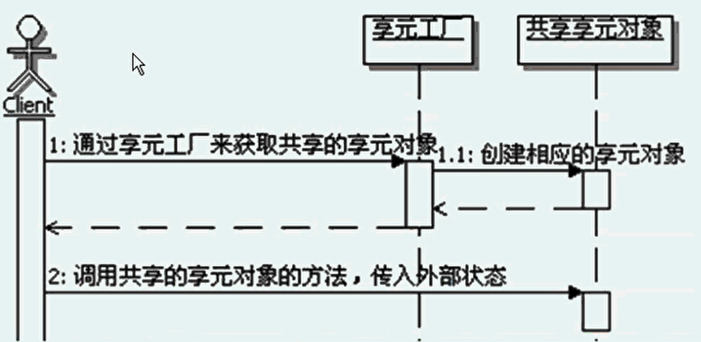

#享元模式
```
定义：
    运用共享技术有效地支持大量细粒度的对象。
    
变与不变：
    享元模式设计的重点就在于分离变与不变，把一个对象的状态分成内部状态和外部状态，内部状态是不变的，外部状态是可变的。
    然后通过共享不变的部分，达到减少对象数据、并节约内存的目的。
    在享元对象需要的时候，可以从外部传入外部状态给共享的对象，共享对象会在功能处理的时候，使用自己内部的状态和这些外部的状态。
    
共享与不共享：
    享元模式中，享元对象又有共享与不共享之分，这种情况通常出现在跟组合模式合用的情况，
    通常共享的是叶族对象，一般不共享的部分是由共享部分组合而成的，由于所有细粒度的叶子对象已经缓存了，那么缓存组合对象就没有什么意义了。

内部状态和外部状态：
    内部状态：通常指的是包含在享元对象内部的，对象本身的状态，通常是独立于使用享元的场景的信息，一般创建后就不再变化的状态，因此可以共享。
    外部状态：享元对象之外的状态，取决于使用享元的场景，会根据使用场景而变化，因此不可共享。如果享元对象需要这些外部状态的话，可以从外部传递到享元对象里面。
    享元模式真正缓存和共享的数据是享元的内部状态，而外部状态是不应该被缓存共享的。
    另外，内部状态和外部状态是独立的，外部状态的变化不应该影响到内部状态。
    
实例池：
    在享元模式中，为了创建和管理共享的享元部分，引入了享元工厂，享元工厂中一般都包含有享元对象的实例池，享元对象就是缓存在这个实例池中的。
    实例池指的是缓存和管理对象实例的程序，通常实例池会提供对象实例和运行环境，并控制对象实例的生命周期。
    工业级的实例池实现上有两个最基本的难点，一个就是动态控制实例数量，一个就是动态分配实例来提供给外部使用。这些需要算法来做保证。
    享元模式中的实例池比较简单，因为共享的享元对象基本都是单例，使用不用考虑动态创建和销毁享元对象实例的功能，且不存在调度问题。
    
享元对象调用示意图：
    只有共享的享元对象的情况下：
        
    既有需共享的享元对象又有不需要共享的

谁来初始化：
    享元模式中，通常是在第一次向享元工厂请求获取共享对象的时候，进行更新对象的参数，而且多半都是在享元工厂内部实现，不会从外部传入共享对象。
    当然可以从外部传入一些创建共享对象需要的值，享元工厂可以按照这些值去初始化需要共享的对象，
    然后就把创建好的共享对象的实例放入享元工厂内部的缓存中，以后再请求这个共享对象的时候就不用再创建了。

不需要共享的享元实现：
    在实际开发中，存在不需要共享的享元实现，这种情况多出现在组合结构中，对于使用已经缓存的享元组合出来的对象，就没必要再缓存了，
    也就是把已经缓存的享元当作叶子节点，组合出来的组合对象就不需要再被缓存了。也把这种享元称为复合享元。

对享元对象的管理：
    虽然享元模式对于共享的享元对象实例的管理要求没有实例池对实例管理的要求那么高，但是也还是有很多自身的特点功能，比如：引用计数、垃圾清理等。
    引用计数：享元工厂能够记录每个享元被使用的次数。
    所谓垃圾就是在缓存中存在，但是不再需要被使用的缓存中的对象。
    垃圾清除：在不需要这些数据的时候，一个把这些数据从缓存中清除，释放相应的内存空间，以节省资源。
                                                                                                                                                                                                                                                                                                                             
实现引用计数的基本思路：
    要实现引用技术，就在享元工厂里面定义一个map，key值与缓存享元对象的key是一样的，而value就是被引用的次数，
    每当外部每次获取该享元的时候，就把对应的引用技术取出来加上1，然后再记录回去。
    
实现垃圾回收的基本思路：
    首先确定哪些是垃圾，其次何时回收，由谁回收，如何回收。
    确定垃圾的简单方案：定义一个缓存对象的配置对象，在这个对象中描述了缓存的开始时间和最长不被使用的时间，判断垃圾的计算公式如下：
    当前的时间-缓存的开始时间>=最长不被使用的时间。当然，每次对象被使用的时候，就把缓存开始时间更新为使用时的当前时间。
    判断出来是垃圾就回送。
    判断和回收，一个简单的方案就是定义一个内部的线程，这个线程在享元工厂被创建的时候就启动运行。
    由这个线程每隔一定的时间来循环缓存中所有对象的缓存配置，看看是否是垃圾，如果是，启动回收机制。
    简单的回收策略可以是直接从缓存的map对象中删除掉相应的对象，让这些对象没有引用的地方，等待虚拟机回收即可。
    
享元模式的优缺点：
    1、减少对象数量，节省内存空间
    2、维护共享对象，需要额外开销
    
享元模式的本质：分离与共享

何时选用享元模式：
    1、如果一个应用程序使用了大量的细粒度对象，可以使用享元模式来减少对象数量。
    2、如果由于使用大量的对象，造成很大的存储开销，可以使用享元模式来减少对象数量，并节约内存
    3、如果对象的大多数状态都可以都可以转为外部状态，比如通过计算得到，或者是从外部传入等，可以使用享元模式来实现内部状态和外部状态的分离。
    4、如果不考虑对象的外部状态，可以用相对较少的共享对象取代很多组合对象，可以使用享元模式来共享对象，然后组合对象来使用这些共享对象。


```


