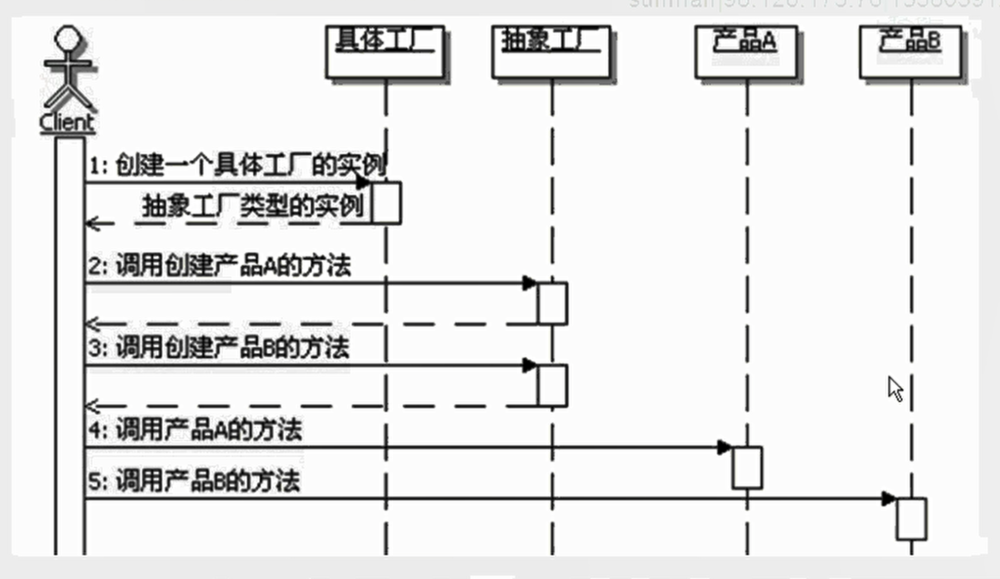

# 抽象工厂模式
```
定义：
    提供一个创建一系列相关或相互依赖对象的接口，而无须指定它们具体的类。

抽象工厂模式：
    功能：
        抽象工厂的功能是为一系列相关对象或相互依赖的对象创建一个接口。
        从某种意义上看，抽象工厂其实是一个产品系列，或者是产品簇。
    实现：
        AbstractFactory在Java中通常实现成为接口，而不是抽象类。
    使用工厂方法：
        AbstractFactory定义了创建产品所需要的接口，具体的实现是在实现类里面。
        通常在实现类里面就需要选择多种更具体的实现，所以AbstractFactory定义的创建产品的方法可以看出是工厂方法，而这些工厂方法的具体实现就延迟到了具体的过程里面。
        也就是说使用工厂方法来实现抽象工厂。
    切换产品簇：
        抽象工厂定义了一个产品簇，因此切换产品簇的时候提供不同的抽象工厂就好了。

顺序示意图：
    

定义可扩展的工厂：
    因为没个抽象工厂为每一种它能创建的产品对象都定义了方法，如果在产品簇中要新增加一种产品。
    当抽象工厂发生变化时，所有的具体工厂实现都要发生变化，非常不灵活。
    一种相对灵活，但不太安全的解决办法：
        抽象工厂里面不需要定义那么多方法，定义一个方法就可以了，给这个方法设置一个参数，通过这个参数来判断具体创建什么产品对象。
        有用只有一个方法，返回类型就不能是静态某个产品类型了，只能是所有产品对象都继承或者实现的这么一个类型，
        
抽象工厂和DAO：
    DAO：数据访问对象，是Data Access Object首字母的简写，用来解决访问数据对象所面临的一系列问题。
    DAO需要抽象和封装所有对数据的访问，DAO承担和数据仓库交互的职责，这也意味着，访问数据所面临的所有问题，都需要DAO在内部来自行解决。
    在实现DAO模式的时候，最常见的实现策略就是使用工厂策略，而且多是通过抽象工厂模式来实现，也可以结合工厂方法模式。

抽象工厂模式的优缺点：
    分离接口和实现
    使得切换产品簇变得容易
    不太容易扩展新的产品
    容易造成类层次复杂

抽象工厂模式的本质：选择产品簇的实现

何时选用：
    1、希望一个系统独立于它的产品的创建，组合和表示的时候，希望系统只知道产品的接口，而不关心具体的实现。
    2、如果一个系统要由多个产品序列中的一个来配置的时候，即可以动态切换产品簇的时候。
    3、如果强调一系列相关产品的接口，以便联合使用它们的时候


```


