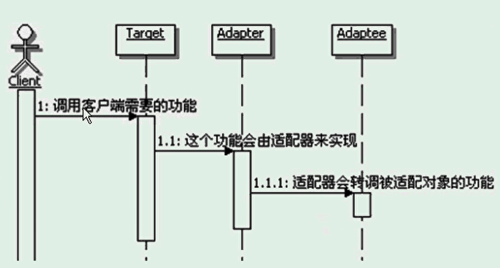

# 适配器模式
```
定义：
    将一个类的接口转换成客户希望的另一个接口。
    适配器模式使得原本由于接口不能兼容而不能一起工作的那些类可以一起工作。
    
使用实例：
    同时支持数据库和文件的日志管理
    
适配器模式的主要功能：
    进行转换匹配，目的是复用已有的功能，而不是来实现新的接口
    适配器里面也可能实现功能，称这种适配器为智能适配器······
被适配对象和适配称为的对象是没有关联的
适配器的实现方式其实是依靠对象组合。

流程示意图：
    

适配器通常是一个类，一般会让适配器类去锁骨下班Target接口，然后在适配器的具体实现里面调用Adaptee
可以在适配器的实现里面，加入新功能的实现，这种适配器被称为智能适配器
可适配多个Adaptee
适配器Adapter实现的复杂程度，取决于Target和Adaptee的相似程度
缺省适配：为一个接口提供缺省实现。创建一个缺省适配器类，让适配器继承。适配器只需按需求重写或者不写即可使用。

双向适配器：
    把Adtatee适配称为Target，也可以把Target适配称为Adtaptee。

```


