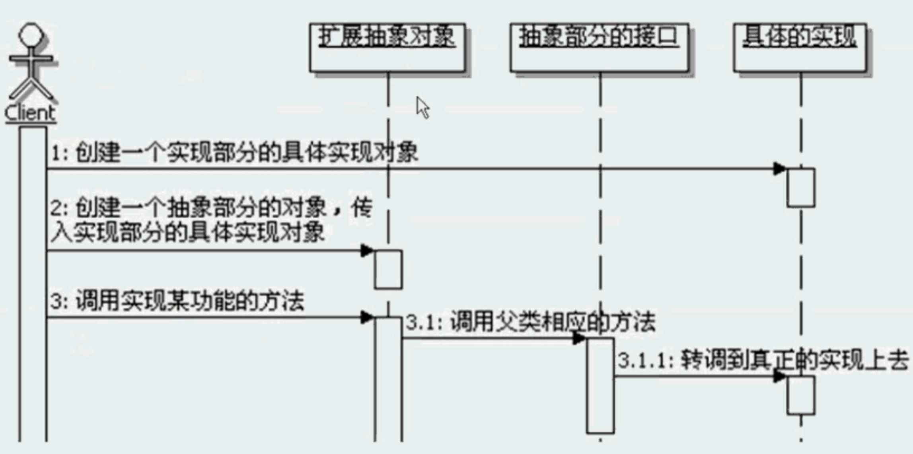

# 桥接模式

```
定义：
    将抽象部分与它的实现部分分离，使它们都可以独立地变化。‘
    
什么是桥接：
    所谓桥接，通俗点说就是在不同的东西之间搭建一个桥，让他们能够连接起来，可以相互通讯和使用。
    代入代码就是为分离了的抽象部分和实现部分来搭桥。
    需要注意：在桥接模式中的桥是单向的，也就是是只能是抽象部分的对象去使用具体实现部分的对象，
    而不能反过来，也就是个单向桥。

为何需要桥接：
    为了达到让抽象部分和实现部分都可以独立变化的目的，在桥接模式中，是把抽象部分和实现部分分离开来的，
    虽然从程序上分离开了，但是在抽象部分实现的时候，还是需要使用具体的实现的，所以使用桥接。

如何桥接：
    让抽象部分拥有实现部分的接口对象，这就桥接上了，在抽象部分就可以通过这个接口来调用具体实现部分的功能。
    也就是说，桥接在程序上就体现成了抽象部分拥有实现部分的接口对象，维护桥接就是维护这个关系。
    
独立变化：
    桥接模式的意图：使得抽象和实现可以独立变化，都可以分别扩充。
    也就是说抽象部分和实现部分是一种非常松散的关系，从某个角度来讲，
    抽象部分和实现部分是可以完全分开的，独立的，抽象部分不过是一个使用实现部分对外接口的程序罢了。
    桥接模式雷神策略模式，桥接模式的抽象部分相当于策略模式的上下文。
    但是桥接模式的抽象部分是可以继续扩展和变化的，而策略模式只有上下文，是不存在所谓抽象部分的。

动态变换功能：
    由于桥接模式中的抽象部分和实现部分是完全分离的，因此可以在运行时动态组合具体的真实实现，从而达到动态变换功能的目的。
    从另一个角度看，抽象部分和实现部分没有固定的绑定关系了，因此同一个真实实现可以被不同的抽象对象使用，反过来，同一个抽象也可以有对各不同的实现。
    
退化的桥接模式：
    如果Implement仅有一个实现，那么就没必要创建Implement接口了，这是一种桥接模式退化的情况。
    这个时候Abstraction和Implementor是一对一的关系，虽然如此，也还是要保持它们的分离状态，
    这样的话，它们才不会相互影响，才可以分别扩展。

桥接模式和继承：
    继承是扩展对象功能的一种常见手段，提出情况下，继承扩展的功能变化维度都是一纬的，也就是变化的因素只有一类。
    对于出现变化因素有两类的，也就是两个维度的情况，继承实现会比较痛苦，比如message包中的实例。
    桥接模式就是用来解决这种有两个变化维度的情况下，如何灵活的扩展功能的一个很好的方案。
    桥接模式主要是把继承改成了使用对象组合，从而把两个维度分开，让每个维度单独去变化，最后通过对象组合的方式，把两个维度组合起来，
    每一种组合的方式就相当于原来继承中的一种实现，主要就有效的减少了实际实现的类的个数。
    也侧面体现了使用对象组合的方式比继承要来的灵活。
    
桥接模式的调用顺序示意图：
    

谁来桥接：
    谁来负责创建Implementor的对象，并把它设置到抽象部分的对象里面去，这点对于使用桥接模式来说，是十分重要的一点。
    大致有如下几种实现方式：
        1、由客户端负责创建Impelementor的对象，并在创建抽象部分的对象的时候，把它设置到抽象部分的对象里面去。
        2、在抽象部分构建的时候，由抽象部分的对象自己来创建相应的Implementor的对象，当然可以给它传递一些参数，
        它可以根据参数来选择并 创建具体的Implementor的对象。
        3、可以在Abstraction中选择并创建一个缺省的Implementor的对象，然后子类可以根据需要改变这个实现。
        4、也可以使用抽象工厂或者简单工厂来选择并创建具体的Implementor的对象，抽象部分的类可以通过调用工厂的方法来获取Implementor的对象。
        5、如果使用IoC/DI容器的话，还可以通过IoC/DI容器来创建具体的Implementor的对象，并注入回到Abstraction中。
        
广义桥接-Java无处不桥接
    使用Java编写程序，一个很重要的原则就是”面向接口变成“，说的准确点应该是”面向抽象编程“，由于在Java开发中，更多的使用接口而非抽象类，
    因此通常就说成”面向接口编程“了。
    接口把具体的实现和使用接口的客户程序分离开，从而使得具体的实现和使用接口的客户程序可以分别扩展，而不会互相影响。
    桥接模式持有抽象接口的目的就是调用具体实现部分的接口中的方法，来完成一定的功能，和直接使用接口没什么不同，只是表现形式上有点不一样。
    从某种角度来讲，桥接模式不过就是”面向抽象变成“这个设计原则的扩展。
    桥接模式是可以连续组合使用的，一个桥接模式的实现部分，可以作为下一个桥接模式的抽象部分。
    可参考代码的三层架构实现，同时，以此类推，可以扩展到N层架构。

桥接模式的优缺点：
    1、分离抽象和实现部分
    2、更好的扩展性
    3、可动态切换实现
    4、可减少子类的个数
    
桥接模式的本质：分离抽象和实现

桥接模式对设计原则的体现：
    很好的实现了开闭原,通常应用桥接模式的地方，抽象部分和实现部分都是可变化的，
    也就是应用会有两个变化维度，桥接模式就是找到这两个变化，并分别封装起来，从而合理的实现OCP。
    桥接模式还很好的体现了，多用对象组合，少用对象继承。

何时选用桥接模式：
   1、如果你不希望在抽象和实现部分采用固定的绑定关系，可以采用桥接模式，来把抽象和实现部分分开，
   然后在程序运行期间来动态的设置抽象部分需要用到的具体的实现，还可以动态切换具体的实现。
   2、如果出现抽象部分和实现部分都应该可以扩展的情况，可以采用桥接模式，让抽象部分和实现部分可以独立的变化，
   从而可以灵活的进行单独扩展，而不是搅在一起，扩展一边会影响另一边。
   3、如果希望实现部分的修改不会对客户产生影响，可以采用桥接模式，客户是面向抽象的接口在运行，实现部分的修改，
   可以独立于抽象部分，也就不会对客户产生影响了，也可以说对客户是透明的。
   4、如果采用继承的实现方案，会导致产生很多子类，对于这种情况，可以考虑采用桥接模式，分析功能变化的原因，
   看看是否能分离成不同的维度，然后通过桥接模式来分离它们，从而减少子类的数目。
   


```

