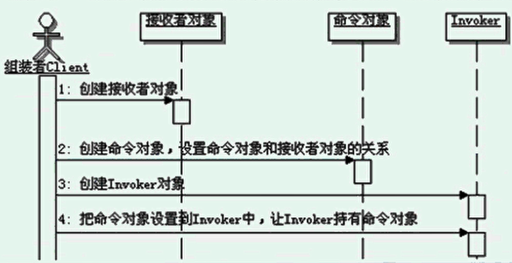

# 命令模式

```
定义：
    将一个请求封装为一个对象，从而使你可用不同的请求对客户进行参数化；
    对请求排队或记录请求日志，以及支持可撤销的操作。
    
命令模式的关键：
    命令模式是关键之处就是把请求封装成为对象，也就是命令对象，并定义了统一的执行操作的接口，
    这个命令对象可以被存储、转发、记录、处理、撤销等，整个命令模式都是围绕这个对象在进行。
    
命令模式的组装和调用：
    在命令模式中经常会有一个命令的组装者，用来维护命令的“虚”实现和真实实现之间的关系。
    如果是超级智能的命令，也就是说命令对象自己完全实现好了，不需要接收者，那就是命令模式的退化，
    不需要接收者，自然也不需要组装者了。
    真正的用户就是具体化请求的内容，然后提交请求进行触发就好了。真正的用户会通过invoker来触发命令。
    实际开发中，Client和Invoker可以融合在一起，由客户端在使用命令时先进行命令对象和接收者的组装，然后再调用命令执行请求。

命令模式的接收者：
    可以是任意类，这个对象知道如何真正执行命令的操作，执行时是从command的实现类里面转调过来的 。
    一个接收者对象可以处理多个命令，接收者和命令之间没有约定的对应关系。接收者通过的方法个数、名称、功能和命令中的可以不一样，
    只要能通过调用接收者的方法来实现命令对应的功能就可以了。
    
智能命令：
    在标准的命令模式里面，命令的实现类是没有真正实现命令要求的功能的，真正执行命令的功能的是接收者。
    如果命令的实现对象比较智能，自己能真实实现命令要求的功能，不需要调用接收者，则称为智能命令。
    
发起请求的对象和真正实现的对象是解耦的
    请求究竟是谁处理的，如何处理，发起请求的对象是不知道的，发起请求的对象只管发出命令，其他就不管了。
    
命令模式的调用顺序示意图：
    

参数化配置：
    可以用不同的命令对象，去参数化配置客户的请求。

可撤销的操作：放弃该操作，回到未执行该操作前的状态。
    两种方式实现：
        补偿式（又称反操作式）：比如被撤销的操作是加，则撤销操作为减。
        存储恢复式：把操作前的状态记录下来，然后要撤销操作的时候就直接恢复回去就可以了。【通常使用备忘录模式】
        
宏命令：
    包含多个命令的命令，是一个命令的组合。
    
队列请求：
    命令对象进行排队，组成工作队列，然后依次取出命令对象来执行。多用多线程或者线程池来进行命令队列的处理，当然也可以不用多线程。

日志请求：
    把请求的历史记录保存下来，一般是采用永久存储的方式。
    如果运行请求的过程中，系统崩了，那么在系统再次运行时，就可以从保留的历史记录里面获取日志请求，并重新执行。
    日志请求的实现有两种方案，一种是直接使用Java的序列化方法，
    另一种就是在命令对象里面添加上存储和装载的方法，其实就是让命令对象自己实现类似序列化的功能。

命令模式的优缺点：
    1、更松散的耦合
    2、更动态的控制
    3、能很自然的复合命令
    4、更好的扩展性

命令模式的本质是：封装请求

何时选用：
    1、如果需要抽象出需要执行的动作，并参数化这些对象，可以选用命令模式，
        把这些需要执行的动作抽象成为命令，然后实现参数化配置。
    2、如果需要在不同的时刻指定、排列和执行请求，可以选用命令模式，
        把这些请求封装成为命令对象，然后实现把请求队列化。
    3、如果需要支持取消操作，可以选用命令模式，通过管理命令对象，能很容易实现命令的回复和重做功能。
    4、如果需要支持当系统崩溃时，能把对系统的操作功能重新执行一遍，可以选用命令模式，
        把这些操作功能的请求封装成命令对象，然后实现日志命令，就可以在系统恢复回来以后通过日志获取命令列表，从而重新执行一遍功能。
    5、在需要事务的系统中可以选用命令模式，命令模式提供了对事务进行建模的方法，命令模式有一个别名就是Transaction。
        
退化的命令模式：
    如果命令的实现对象超级智能，实现了命令所要求的功能，那么就不需要接收者了，既然没有了接收者，那么也就不需要组装者了。

命令模式其实就是一种Java的回调。


```

