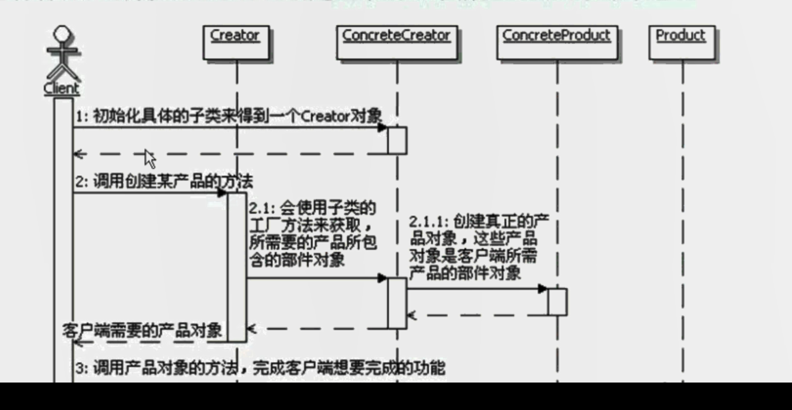

# 工厂方法模式
```
定义：
    定义一个用于创建对象的接口，让子类决定实例化哪一个类，Factory Method使一个类的实例化延迟到其子类。

工厂方法模式的功能：
    主要是让父类在不知道具体实现的情况下，完成自身的功能调用，而具体的实现延迟到子类来实现。
实现成抽象类：
    工厂方法的实现中，通常父类会是一个抽象类。里面包含创建所需对象的抽象方法，这些抽象方法就是工厂方法。
实现成具体的类：
    也可以把父类实现成为一个具体的类，这种情况下，通常是在父类中提供获取所需对象的默认实现方法，这样就算没有具体的子类，也能够运行。
工厂方法的参数和返回值：
    工厂方法的实现中，可能需要参数，以便决定到底选用哪一种具体的实现。
    一般工厂方法返回的是被创建对象的接口对象，当然也可以是抽象类或者一个具体的类的实例。
使用工厂方法创建的对象：
    1、在工厂方法模式中，一个是Creator中的其他方法在使用工厂方法创建对象。
    2、客户端应该是使用Creator对象，或者是使用由Creator创建出来的对象，这个工厂方法创建的对象，是Creator中的某些方法使用。
    3、在某些情况下，客户端可能会使用由Creator创建出来的对象，这个时候工厂方法创建的对象，是构成客户端需要的对象的一部分。
    
流程图：
                 

工厂方法模式与IoC/DI
    概念：
        依赖注入：应用程序依赖容器创建并注入它所需要的外部资源。
        控制反转：容器控制应用程序，由容器反向的向应用程序注入应用程序所需的外部资源。
    理解：
        参与者：应用程序和容器
        依赖：应用程序依赖容器，因为应用程序需要一些资源，资源由容器创建并注入。
        注入：容器注入应用程序，需要什么就注入什么。
        控制反转：容器控制应用程序，控制应用程序所需要的资源，资源控制权从应用程序转移到容器。
        依赖注入和控制反转的对比：对同一件事情的不同描述。
    思想：
        思想上发生了“主从换位”的变换。从应用程序主动获取编程了被动等待注入。
        有效的分离了对象和它所需的外部资源，使得它们松散耦合，有利于功能复用，使得程序整体结构更加灵活。

平行的类层次结构：
    假如有两个类层次结构，其中一个类层次中的每个类在另一个类层次中都有一个对应的类的结构，就被称为平行的类层次结构。
    主要用来把一个类层次中的某些行为分离出来，让类层次中的类把原本属于自己的职责，委托给分离出来的类去实现，从而使得类层次本身变得更简单更容易扩展和复用。
    可以使用工厂方法模式来连接平行的类层次。

参数化工厂方法：
    通过工厂方法传递参数，让工厂方法根据参数的不同来创建不同的产品对象。
    当需要拓展新的实现，使用参数化工厂方法，扩展起来会非常容易。

工厂方法模式的优缺点：
    可以在不知具体实现的情况下编程
    更容易扩展对象的新版本
    连接平行的类层次
    具体产品对象和工厂方法的耦合

工厂方法模式的本质：延迟到子类来选择实现

简单工厂方法其实是工厂方法模式的特例。

工厂方法模式很好的体现了“依赖倒置”原则
    依赖倒置原则告诉我们“要依赖抽象，不要依赖于具体类”，
    不能让高层组件依赖于低层组件，而且不管高层组件还是底层组件，都应该依赖于抽象。

何时选用：
    如果一个类需要创建某个接口的对象，但是又不知道具体的实现，这种情况可以选用高层方法模式，把创建对象的工作延迟到子类去实现。
    如果一个类本身就希望由它的子类来创建所需的对象的时候，应该使用工厂方法模式。
    


```