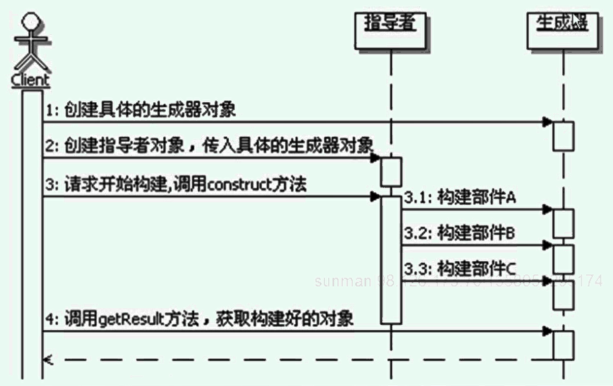

#生成器模式
```
定义：
    将一个复杂对象的构建与它的表示分离，使得同样的构建过程可以创建不同的表示。
    
生成器模式的功能：
    生成器模式的功能是构建复杂的产品，而且是细化的，分步骤的构建产品，重在解决一步一步构造复杂对象的问题。
    更重要的是构建过程是统一的，固定不变，变化的部分放到生成器部分了，只要配置不同的生成器，那么同样的构建过程就能构建出不同的产品来。
    生成器模式的重心在于分离构建算法和具体的构造实现，从而使得构建算法可以重用，具体的构造实现可以很方便的拓展和切换，从而可以灵活的组合来构造出不同的产品对象。

生成器模式的构成：
    1、一个部分是Builder接口这边，这边是定义了如何构建各个部件，也就是知道每个部件功能如何实现，以及如何装配这些部件到产品中去。
    2、另一个部分是Director，Director知道如何组合来构建产品，Director负责整体的构建算法，而且通常是分步骤来执行的。

调用顺序：
    

生成器模式的实现：
    生成器的实现 
        实际上在Builder接口的实现中，每个部件构建的方法里面，除了部件装配外，也可以实现如何具体的创建各个部件对象，
        也就是说每个方法都可以由两部分功能，一个是创建部件对象，一个是组装部件。
        在构建部件的方法里面可以实现选择并创建具体的部件对象，如何再把这个部件对象组装到产品对象中去，
        这样Builder就可以与工厂方法配合使用了。
        如果在实现Builder的时候，只有创建对象的功能，而没有组装的功能，那么这时候的Builder实现跟抽象工厂的实现是类似的。
    指导者的实现：
        在生成器模式里面，指导者承担的是整体构建算法部分，是相对不变的部分，因此在实现指导者的时候，把变化的部分分离出去是很重要的。
        指导者分离出去的变化部分，就到了生成器那边，指导者知道整体的构建算法，就是不知道如何具体的创建和装配部件对象。
        因此真正的指导者实现，并不仅仅是简单的按照顺序调用生成器的方法来生成对象，
        应该有较为复杂的算法和运算过程，在运算过程中根据需要，才会调用生成器的方法来生成部件对象。
    指导者和生成器的交互：
        生成器模式里面，指导者和生成器的交互，是通过生成器的那些buildPart方法来完成的。
        指导者通常会实现比较复杂的算法或者是运算过程，在实际中很可能就会有这样的情况
            a:在运行指导者的时候，会按照整体构建算法的步骤进行运算，可能先运行前几步运算，
            到某一步骤，需要具体创建某个部件对象了，然后就调用Builder中创建相应部件的方法来创建具体的部件。
            同时，把前面运算得到的数据传递给Builder,因为Builder内部实现创建和组装部件的时候，可能会需要这些数据。
            b:Builder创建完具体的部件对象后，会把创建好的部件对象返回给指导者，指导者继续后续的算法运算，可能会用到已经创建好的对象。
            c:如此反复，直到整个构建算法运行完成，产品被创建好。
    返回装配好的产品的方法：
        在标准的生成器模式里面，在Builder实现里面会提供一个返回装配好的产品的方法，在Budiler接口上是没有的。
        它考虑的是最早的对象一定要提供部件构建和装配，才算是真正创建了，而具体干活的就是这个Builder实现，
        虽然指导者也参与了，但是指导者不负责具体的部件创建和组装，因此客户端是从Builder实现里面获取最值装配好的产品。
    关于被构建的产品的接口：
        在使用生成器模式的时候，大多数情况下是不知道最终构建出来的产品是什么样的，所以在标准的生成器模式里面，一般是不需要对产品定义抽象接口的，
        因为最早构造的产品千差万别，给这些产品定义公共接口几乎是没有意义的。

使用生成器构建复杂对象：
    1、使用Builder模式来构建复杂对象，先考虑带约束
    2、使用Builder模式来构建复杂对象，考虑带约束规则
    3、进一步，把构建对象和被构建对象合并
    （采用被构建对象构造方法私有化，构建器类作为构建对象的静态内部类）

生成器模式的优缺点：
    1、松散耦合
    2、可以很容易的改变产品的内部表示
    3、更好的复用性

生成器模式的本质：分离整体构建算法和部件构造

何时选用生成器模式：
    1、如果创建对象的算法，应该独立于该对象的组成部分以及他们的装配方式时
    2、如果同一个构建过程有着不同的表示时


```


