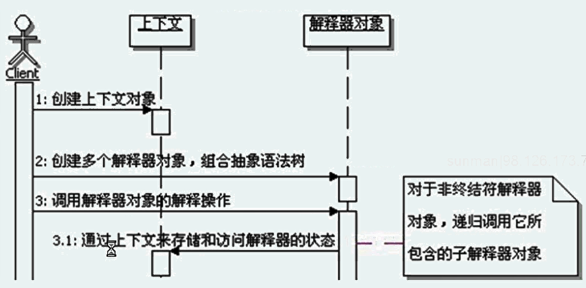

#解释器模式
```
定义：
    给定一个语义，定义它的文法的一种表示，并定义一个解释器，这个解释器使用该表示来接解释语义中的句子。

解释器模式的功能：
    解释器模式使用解释器对象来表示和处理相应的语法规则，一般一个解释器处理一条语法规则。
    理论上来说，只要能用解释器对象把符合语法的表达式表示出来，而且能够构成抽象的语法树，那都可以使用解释器模式来处理。
    
语法规则和解释器
    语法规则和解释器之间是有对应关系的，一般一个解释器处理一条语法规则，但是反过来并不成立，一条语法规则是可以有多种解释和处理的，
    也就是一条语法规则可以对应多个解释器对象。

上下文的公用性：
    上下文在解释器模式中起到非常重要的作用，由于上下文会被传递到所有的解释器中，
    因此，可以在上下文中存储和访问解释器的状态，比如前面的解释器可以存储一些数据在上下文中，后面的解释器就可以获取这些值。
    另外也可以通过上下文传递一些在解释器外部，但是解释器又需要的数据，也可以是一些全局的，公共的数据。
    上下文还有一个功能，可以提供所有解释器对象的公共功能，类似于对象组合，而不是使用继承来获取公共功能，在每个解释器对象里面都可以调用。

谁来构建抽象语法树：
    解释器模式不负责构建抽象语法树，只负责对构建好的抽象语法树进行解释执行。
    一条语法规则可以对应多个解释器对象，也就是说同一个元素，是可以转换成多个解释器对象的，
    这也就意味着同样一个表达式，是可以构成不同的抽象语法树的，也就造成构建抽象语法树变得很困难，而且工作量很大。
    
谁负责解释操作：
    只要定义好抽象语法树，肯定是解释器来负责解释执行。虽然有不同的语法规则，但是解释器不负责选择究竟用哪个解释器对象来解释执行语法规则，
    选择解释器的功能在构建抽象语法树的时候就完成了。

解释器模式的调用顺序示意图：
    

解析器：
    解析器负责把表达式，解析转换成为解释器需要的抽象语法树。
    当然解析器是跟表达式的语法，还有解释器对象紧密关联的。
    解析器有多种实现方式，只要能完成相应的功能即可，比如表驱动、语法分析生成程序等。
    
解析器实现思路
    1、把客户端传递来的表达式进行分解，分解成为一个一个的元素，并用一个对应的解析模型来封装这个元素的一些信息。
    2、根据每个元素的信息，转化成相应的解析器对象
    3、按照先后顺序，把这些解析器对象组合起来，得到抽象语法树

第一步与第二步分离的原因：
    一方面功能分离，不要让一个方法的功能过于复杂。
    二是不方便以后的修改和扩展
    事实上，封装解析属性的数据模型充当了第一步和第二步操作间的接口，使得第一步和第二步都变得简单了。
    
解释器模式的优缺点：
    1、易于实现语法
    2、易于扩展新的语法
    3、不适合复杂的语法
    
解释器模式的本质：分离实现，解释执行

何时选用解释器模式：
    当有一个语言需要解释执行，并且可以将该语言中的句子表示为一个抽象语法树的时候，可以考虑使用解释器模式。
    使用解释器模式的时候，有两个特点需要注意，
    一是语法相对应该比较简单，太复杂的语法不适合使用解释器模式，
    另一个是效率要求不是很高，对效率要求很高的情况下，不适合使用解释器模式。
    


```