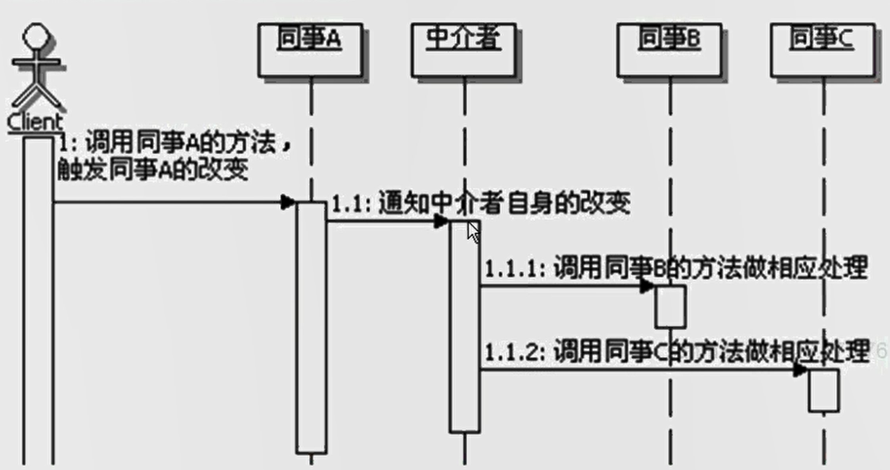

# 中介者模式
```
定义：
    用一个中介对象来封装一系列的对象交互。
    中介者使得各对象不需要显式地相互引用，从而使其耦合松散，而且可以独立改变它们之间的交互。

中介者模式的功能：封装对象之间的交互。
    如果一个对象的操作会引起其他相关对象的变化，或者是某个操作需要引起其他对象的后续或连带操作，
    而这个对象又不希望自己来处理这些关系，那么就可以使用中介者模式，让中介者处理。
    其他的对象在操作的时候，可能会引起这个对象的变化，也可以使用中介者。
    松散了对象间的耦合，还能集中的控制这些对象的交互关系。
    
是否需要Mediator接口：
    取决于是否会提供多个不同的中介者实现，如果只有一个中介者，且预计中也没有需要扩展的要求，则可以省略。
    
同事关系：
    在中介者模式中，要求这些类都要继承相同的类，也就是说，这些对象从某个角度讲是同一个类型，算是兄弟对象。
    因为这些兄弟对象之间的交互关系很复杂，才产生了把这些交互关系分离出去，单独做成中介者对象。

同事和中介者的关系：
    二者相互依赖。

如何实现同事和中介者的通信：
    一种实现方式是在Mediator接口中定义一个特殊的通知接口，作为一个通用的方法，让各个同事类来调用这个方法。
    另外一种实现方式是采用观察者模式，把Mediator实现成为观察者，而各个同事类实现成为Subject,这样同事类发生了改变，会通知Mediator。
    Mediator在接到通知过后，会与相应的同事对象进行交互。

中介者模式调用顺序示意图：
    

标准中介者模式的问题：
    1、关于公共的父类
        Java的单继承的，为了使用中介者模式，就让同事对象继承一个父类，且父类没有特别的公共功能，不是很好。
        实际开发中，大部分交互对象本身是没有公共父类的。
    2、同事类有必要持有中介者对象么。
        同事类状态改变时需要通知中介者，但可以通过更简单的方式，比如把中介对象做成单例，直接在同事类中调用。
    3、是否需要中介者接口
        实际开发中，很常见的情况是不需要中介者接口的，而且中介者也不需要创建很多个实例，
        因为中介者用来封装和处理同事对象的关系，一般是没有状态需要维护的，因此通常可以实现为单例。
    4、中介者是否需要持有所有同事
        虽说中介者对象需要做的所有的同事类，这样才能交互。但不一定需要做成属性，可以在中介者处理的方法里面创建或者获取，或者从参数传入等。
    5、中介者对象只提供一个公共方法，来接受同事对象的通知么？
        公共方法里面还需要区分到底是谁调过来，没有区分到底是什么样的业务触发调用的。
    
对标准中介者模式实际应用的改进：
    1、通常会去掉同事对象的父类，任意对象只要需要交互就可以成为同事。
    2、通常不定义Mediator接口，把具体的中介者对象实现成为单例
    3、同事不再持有中介者对象，而是需要的时候直接获取中介者对象并调用，中介者也不再持有同事对象，
    而是在具体出库方法里面去创建或者获取或者从参数传入。
    
中介者模式的优缺点：
    松散耦合
    集中控制交互
    多对多编程一对多
    过度集中化

中介者模式的本质：封装交互

何时选用：
    1、如果一组对象之间的通信方式比较复杂，导致相互依赖，结构混乱，
    可以采用中介者模式，把这些对象相互地交互管理起来，对象只需要跟中介者交互，从而松散对象间的耦合，结构也更加清晰。
    2、如果一个对象引用很多对象，并直接跟这些对象交互，导致难以复用该对象。
    可采用中介者模式，把这个对象跟其他对象的交互封装到中介者对象里面。
    3、


```


