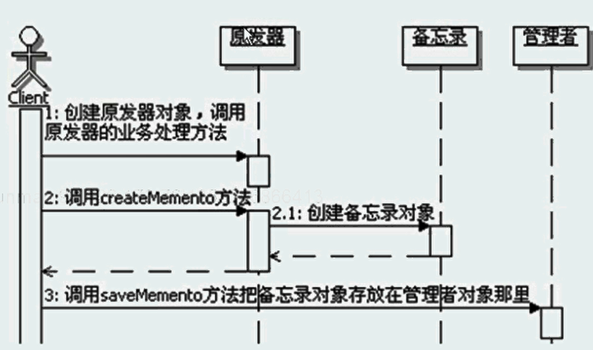
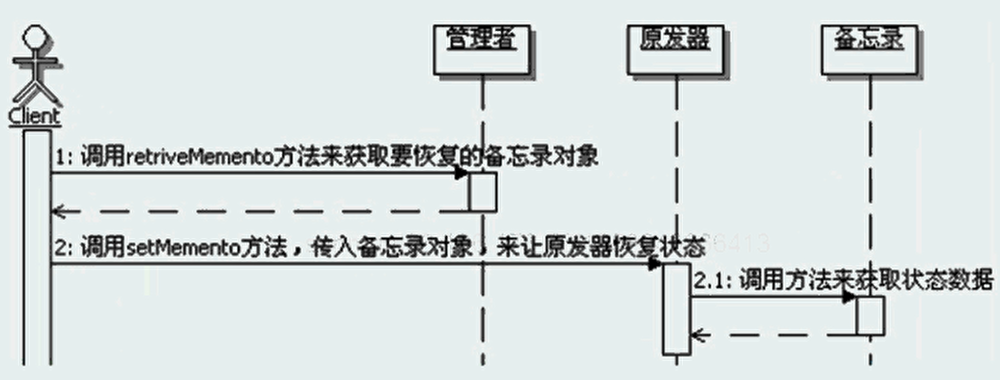

#备忘录模式
```
定义：
    在不破坏封装性的前提下，捕获一个对象的内部状态，并在该对象之外保存这个状态。
    这样以后就可以将该对象恢复到原先保存的状态。

备忘录模式的功能：
    在不破坏封装性的前提下，捕获一个对象的内部状态。
    需要注意两点：
        一是不破坏封装性，也就是对象不能暴露它不应该暴露的细节
        另一个是捕获的是对象的内部状态，而且通常还是运行期间某个时刻，对象的内部状态。
    捕获这个对象的内部状态是为了以后的某个时候，将该对象的状态恢复到备忘录所保存的状态，备忘录模式的目的就是为了以后的恢复。
    备忘录模式中，捕获的内部状态，存储在备忘录对象中，而备忘录对象通常会被存储在原发器对象之外，通常是存放在管理者对象那里。
    
备忘录对象：
    备忘录对象通常就是用来记录原发器需要保存的状态的对象，简单的实现就是封装数据的对象。
    备忘录对象和普通的封装数据的区别在于备忘录对象一般只让原发器对象来操作，而不是像普通的封装数据的对象那样，谁都可以使用。
    为了实现，通常会把备忘录对象作为原发器对象的内部类来实现，而且会实现成私有的，断绝了外部来访问这个备忘录对象的途径。
    备忘录对象需要保存在原发器对象之外，为了与外部交互，通常备忘录对象都会实现一个窄接口，来标识对象的类型。
    
管理者对象：
    在备忘录模式中，管理者对象，主要是负责保存备忘录对象。
    1、并不一定要特别做出一个管理者对象来，广义地说，调用原发器获得备忘录对象后，备忘录对象放在哪里，哪个对象就可以算是管理者对象。
    2、管理者对象并不是只能管理一个备忘录对象，一个管理者对象可以管理多个备忘录对象。
    3、狭义的管理者对象，是只管理同一类的备忘录对象，但是广义管理者对象是可以管理不同类型的备忘录对象的。
    4、管理者对象需要实现的基本功能主要就是：存入备忘录对象，保存备忘录对象、获取备忘录对象，
    如果从功能上看，就是一个缓存功能的实现，或者是一个简单的对象实例池的实现。
    5、窄接口和宽接口
    窄接口：管理者只能看到备忘录的窄接口，它的实现里面通常没有任何的方法，只是一个类型标识，窄接口使得管理者只能将备忘录传递给其他对象。
    宽接口：原发器能够看到一个宽接口，允许它访问所需的所有数据，来返回到先前的状态。
        理想的情况是：只允许生成备忘录的原发器来访问该备忘录的内部状态，通常实现成为原发器内的一个私有内部类。
    备忘录模式的标准实现方式就是窄接口，没有任何方法，把备忘录对象实现成为原发器对象的私有内部类。
    可以在窄接口提供备忘录对象对外的方法，但是通常情况是不会这么做的，因为违反了备忘录模式要求的“不破坏封装性的前提下”，会暴露内部细节。
    备忘录模式在实现的时候，对外多是采用窄接口，而且通常不会定义任何方法。

使用备忘录的潜在代价：
    标准的备忘录模式的实现机制是依靠缓存来实现的，因此，当需要备忘的数据量较大时，或者是存储的备忘录对象数据量不大，但是数量很多的时候，
    或者是用户很频繁的创建备忘录对象的时候，这些都会导致非常大的开销。
    因此在使用备忘录模式的时候，一定要好好思考应用的环境，如果使用的代价太高，就不要选用备忘录模式，可以采用其他的替代方案。
    
增量存储：
    如果需要频繁的创建备忘录对象，而且创建和应用备忘录对象来恢复状态的顺序是可控的，那么可以让备忘录进行增量存储，
    也就是备忘录可以仅仅存储原发器内部相对于上一次存储状态后的增量改变。 
    比如在命令模式实现可撤销命令的实现中，就可以使用备忘录来保存每个命令对应的状态，然后在撤销命令的时候，使用备忘录来恢复这些状态。
    由于命令的历史列表是按照命令的顺序来存放的，也是按照这个历史列表来进行取消和重做的，因此顺序是可控的。
    这种情况下，还可以让备忘录对象只存储一个命令所产生的增量改变而不是它影响的每一个对象的完整状态。 

 备忘录模式调用顺序示意图
    第一阶段是创建备忘录对象的阶段
    
    第二阶段是使用备忘录对象来恢复原发器对象的状态的阶段
    

离线存储：
    标准的备忘录模式没有离线存储的实现。
    事实上，从备忘录模式的功能和实现上，是可以把备忘录的数据实现成为离线存储的，从而支持跨越会话的备份和恢复功能。
    离线存储甚至能帮助应对应用崩溃，然后关闭重启的情况，应用重启过后，从离线存储里面获取相应的数据，然后重新设置状态，恢复到崩溃前的状态。
    
备忘录模式的优缺点：
    1、更好的封装性
    2、简化了原发器
    3、窄接口和宽接口
    4、可能会导致高开销
    
备忘录模式的本质：保存和恢复内部状态。

何时选用：
    1、如果必须保存一个对象在某一个时刻的全部或者部分状态，这样在以后需要的时候，可以把该对象恢复到先前的状态。
    可以使用备忘录模式，使用备忘录对象来封装和保存需要保存的内部状态，然后把备忘录对象保存到管理者对象里面，
    在需要的时候，再从管理者对象里面取出备忘录对象，来恢复对象状态。
    2、如果需要保存一个对象的内部状态，但是如果用接口来让其他对象之间得到这些需要保存的状态，将会暴露对象的实现细节，并破坏对象的封装性。
    可以使用备忘录模式，把备忘录对象实现成为原发器对象的内部类，而且是私有的，从而保证只有原发器对象才能访问该备忘录对象。
    这样及保存了需要保存的状态，又不会暴露原发器对象的内部实现细节。


```


