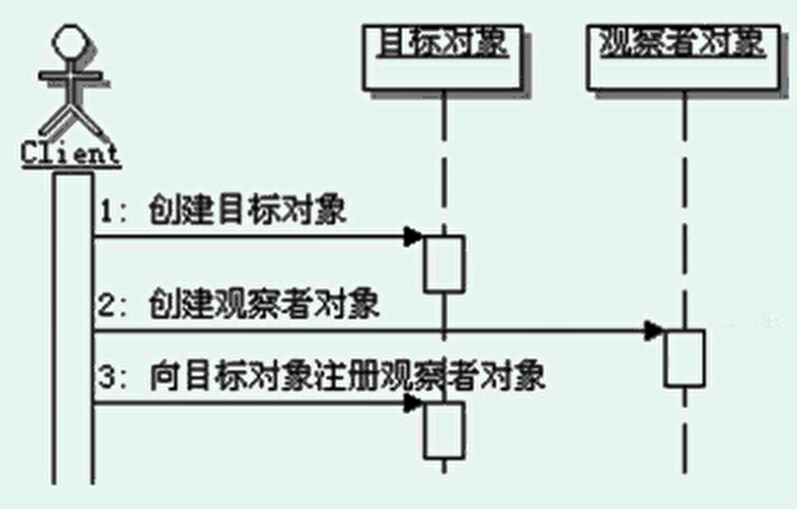
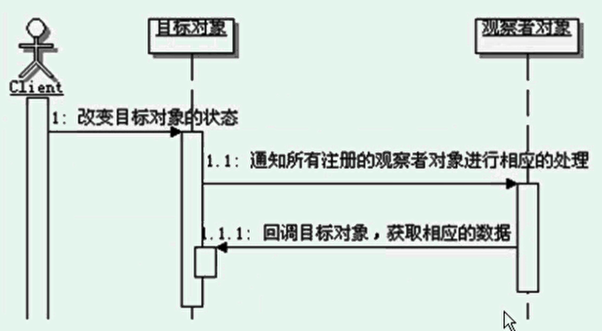

# 观察者模式
```
定义：
    定义对象间的一对多的依赖关系，当一个对象的状态发生改变时，所以依赖于它的对象都得到通知并被自动更新。

目标和观察者之间的关系：
    目标和观察者之间是典型的一对多的关系。
    如果观察者只有一个，也是可以的，如果处理一个对象的状态变化会影响到另一个对象的时候，也可以考虑使用观察者模式。
    同理，一个观察者也可以观察多个目标，如果观察者为多个目标定义的通知更新方法但是update方法的话，需要在方法内部进行区分。
    一般情况下，观察者应该为不同的观察者目标定义不同的回调方法。

单向依赖：
    观察者模式中，观察者和目标是单向依赖的，只有观察者依赖目标，而目标是不会依赖观察者的。
    
基本的实现说明：
    具体的目标实现对象要能维护观察者的注册信息。
    具体的目标对象需要维护引起通知的状态，一般情况下是目标自身的状态，变形使用的情况下，也可以是别的对象的状态。
    具体的观察者实现对象需要能接收目标对象的通知，能够接收目标传递的数据，或者是能够主动去获取目标的数据，并进行后续处理。
    
命名建议：
    1、观察者模式又被称为发布-订阅模式
    2、目标接口的定义，建议在名称后面跟Subject
    3、观察者接口的定义，建议在名称后面跟Observer
    4、观察者接口的更新方法，建议名称为update,当然方法的参数根据需求定义。
    
触发通知的时机：
    一般情况下，是在完成了状态维护后触发，因为通知会传递数据，不能够先通知后改数据，
    这很容易出问题，会导致观察者和目标对象状态不一致。

相互观察：
    A对象的状态变化会引起C对象的联动操作，反过来，C对象的状态变化也会引起A对象的联动操作。
    对于出现这种状况，要特别小心处理，因为可能会出现死循环是情况。
    
观察者模式的调用顺序示意图：
    准备阶段：
    
    运行阶段：
    

通知的顺序：
    理论上，当目标对象的状态改变后通知所有观察者的时候，顺序是不确定的。
    因此观察者实现的功能，绝对不要依赖于通知的顺序，观察者之间的功能应该是平行的。
    
推模型和拉模型：
    推模型：目标对象主动向观察者推送目标的详细信息，不管观察者是否需要，
        推送的信息通常是目标对象的全部或部分数据，相当于是在广播通信。
    拉模型：目标对象在通知观察者的时候，只传递少量信息，如果观察者需要更具体的信息，
        由观察者主动到目标对象中获取，相当于是观察者从目标对象中拉数据。
        一般这种模型的实现，会把目标对象自身通过update方法传递给观察者，
        这样在观察者需要获取数据的时候，就可以通过这个引用来获取了。

两种模型的比较：
    1、推模型是假定目标对象知道观察者需要的数据，而拉模型是目标对象不知道观察者具体需要什么数据，
        没有办法的情况下，干脆把自身传给观察者，让观察者按需取值。
    2、推模型可能会使得观察者对象难以复用，因为观察者定义的update方法是按需而定义的，
        可能无法兼顾没有考虑到的使用情况。这就意味着出现新情况的时候，就可能需要提供新的update方法，
        或者干脆出现实现观察者。
        而拉模型就不会造成这样的情况，因为拉模型下，update方法的参数是目标对象本身，
        这基本上是目标对象能传递的最大数据集合了，基本上可以适应各种情况的需要。
        
Java中的观察者模式：
    在java.util包里面有一个类Observable,它实现了大部分我们需要的目标的功能，
    还有一个接口Observer,它里面定义了update的方法，就是观察者的接口。
    
Swing中的观察者模式：
    Swing的事件处理就是典型的观察者模式的应用(早期是责任链模式)。
    Swing组件的被观察的目标，而每个实现监听器的类就是观察者，监听器的接口就是观察者的接口。
    在调用addXXXListener方法的时候就相当于注册观察者。
    当组件被点击，状态发生改变的时候，就会产生相应的通知，会调用注册的观察者的方法，就是我们实现的监听器的方法。

观察者模式的优缺点：
    观察者模式实现了观察者和目标之间的抽象耦合。
    实现了动态联动。
    支持广播通信
    可能会引起无谓的操作

观察者模式的本质：触发联动

何时选用：
    1、当一个抽象模型有两个方面，其中一个方面的操作依赖于另一个方面的状态变化，那么就可以选用观察者模式。
    2、如果在更改一个对象的时候，需要同时连带改变其他的对象，而不知道究竟应该有多少对象需要被连带改变，
    这种情况可以选用观察者模式，被更改的那一个对象很明显就相当于是目标对象，而需要修改的多个其他对象，就作为多个观察者对象了。
    3、当一个对象必须通知其它的对象，但是你又希望这个对象和其他被它通知的对象是松散耦合的，
    也就是说这个对象其实不想知道具体被通知的对象，这种情况可以选用观察者模式，这个对象就相当于是目标对象，而被它通知的对象就是观察者对象了。
    


```


