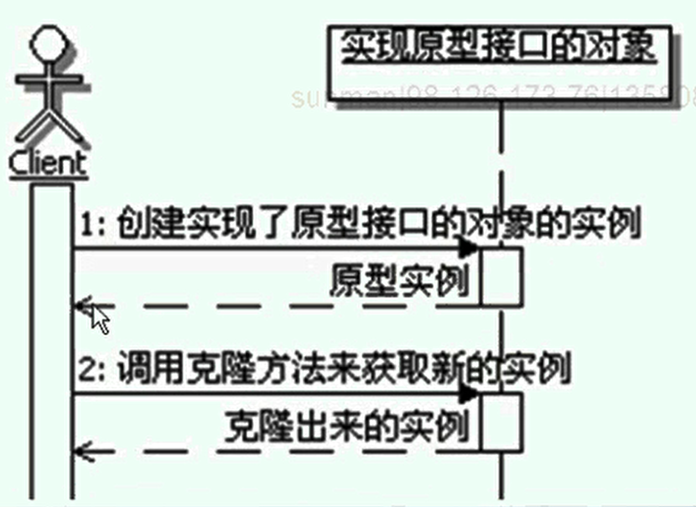

#原型模式
```
定义：
    用原型实例指定创建对象的种类，并通过拷贝这些原型创建新的对象。

原型模式的功能：
    1、一个是通过克隆来创建新的对象实例
    2、另一个是为克隆出来的新对象实例复制原型实例属性的值

克隆对象拥有跟原型拥有一样的属性和值。

原型实例和克隆出来的实例，本质上是不同的实例，没有关联。

原型模式的调用顺序：
    

Java中的克隆方法：
    Java语言中已经提供了clone方法，定义在Object类中。
    需要克隆功能的类只需要实现java.lang.Cloneable接口，这个接口没有需要实现的方法，是一个标识接口。
    因为涉及访问权限，所以需要显示重写clone方法，直接调用super.clone即可 
    但是Java自带的clone是浅拷贝，只能拷贝基本数据类型，深拷贝需要覆盖clone方法，自己实现。
    
浅度克隆和深度克隆：
    浅度克隆：只负责克隆按值传递的数据（比如int、String)
    深度克隆：除了浅度克隆要克隆的值外，还负责克隆引用类型的数据，基本上就是被克隆实例所有的属性的数据都会被克隆出来。
        深度克隆的特点：
            如果被克隆对象里面的属性数据是引用类型，也就是属性的类型也是对象，那么需要一种递归的克隆下去。
            想要深度克隆成功，必须要整个克隆涉及的对象都要正确实现克隆方法，如果其中有一个没有正确实现克隆，那么就会导致克隆失败。
            
原型管理器：
    如果一个系统中原型的数目不固定，比如系统中的原型可以被动态的创建和销毁，那么就需要在系统中维护一个当前可用的原型的注册表，
    这个注册表就被称为原型管理器。
    如果把原型当成一个资源的话，原型管理器就相当于一个资源管理器，在系统开始运行的时候初始化，然后运行期间可用动态的创建和销毁资源。
    
原型模式的优缺点：
    1、对客户端隐藏具体的实现类型 
    2、运行时动态改变具体的实现类型
    3、深度克隆方法实现会比较困难

原型模式的本质：克隆生成对象

何时选用原型模式：
    1、如果一个系统想要独立于它想要使用的对象时，可以使用原型模式，
    让系统只面向接口编程，在系统需要新的对象的时候，可以通过克隆原型来得到。
    2、如果需要实例化的类是在运行时刻动态指定时，可以使用原型模式，通过克隆原型来得到需要的实例。
    


```


