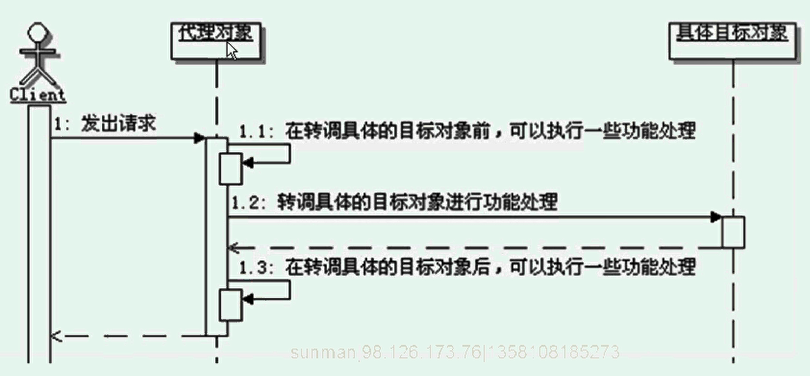

# 代理模式
```
定义：
    为其他对象提供一种代理以控对这个对象的访问

代理模式的功能：
    通过创建一个代理对象，用这个代理对象去代表真实的对象，
    客户端得到这个代理对象过后，当作真实对象来使用。
    客户端操作代理对象时，实际功能最终还是会由真实的对象来完成，
    只不过是通过代理对象操作的，也就是客户端操作代理，代理操作真正的对象。

代理的分类：
    虚代理：根据需要来创建开销很大的对象，该对象只有在需要的时候才会被真正创建。
    远程代理：用来在不同的地址空间上代表同一个对象，这个不同的地址空间可以是在本机，
        也可以在其他机器上，在Java里面最典型的计算RMI技术。
    copy-on-write代理：在客户端操作的时候，只有对象确实改变了，才会真的拷贝（克隆）一个目标对象，算是虚代理的一个分支。
        拷贝一个大对象是很消耗资源的，所以如果这个被拷贝对象从上次操作以来没根本没有被修改过，
        那么就可以使用代理来延迟拷贝的过程，等到真正被修改的时候再进行拷贝。
    保护代理：控制对原始对象的访问，如果有需要，可以给不同的用户提供不同的访问权限，以控制他们对原始对象的访问。
    Cache代理:为那些昂贵的操作的结果提供临时的存储空间，以便多个客户端可以共享这些结果。
    防火墙代理：保护对象不被恶意用户访问和操作
    同步代理：使多个用户能够同时访问目标对象而没有冲突
    智能引导：在访问对象时执行一些附加操作。

目标对象和代理的关系：
    如果代理类能完全通过接口来操作它所代理的目标对象，那代理对象就不需要真的具体的目标对象，这样就无需为每个具体的目标类都创建一个代理类了。
    但是如果代理类必须要实例化它代理的目标对象，那么代理类就必须知道具体的被代理对象，这种情况下，一个具体目标类通常会有一个代理类。
    这种情况多出现在虚代理的实现中。

调用顺序示意图：
    

保护代理：
    一种控制对原始对象访问的代理，多用于对象应该有不同的访问权限的时候。
    保护代理会检查调用者是否具有请求所必须的访问权限，如果没有相应的权限，那么就不会调用目标对象，从而实现对目标对象的保护。
    
Java中的代理：
    1、Java的静态代理
        通常把自己实现的代理模式称为Java静态代理。这种实现方式有一个较大的缺点，
        就是如果Subject接口发生变化，那么代理类和具体的目标实现都要变化，不是很灵活。
    2、Java的动态代理
        通常把使用Java内建的对代理模式支持的功能来实现的代理称为Java的动态代理。
        动态代理跟静态代理相比，明显的变化是：静态代理实现的时候，在Subject接口上定义很多方法，
        代理类里面自然也要实现很多方法，而动态代理实现的时候，虽然Subject接口上定义了很多方法，
        但是动态代理类始终只有一个invoke方法。这样当Subject接口发生变化的时候，动态代理的接口就不需要跟着变化了。
        
代理模式的优缺点：
    代理模式在客户和被客户访问的对象之间引入了一定程度的间接性，不同的代理类型间接性的用途不同，特点也不同。
        1、远程代理：隐藏了一个对象存在于不同的地址空间的事实，客户通过远程代理去访问一个对象，不关心这个对象在哪以及如何获取该对象。
        2、虚代理：根据需要来创建“大”对象，只有到必须创建这个对象的时候，虚代理才会创建对象，从而加快程序运行速度，并节约资源。
        3、保护代理：可以在访问一个对象的前后，执行很多附加的操作，除了进行权限控制之外，还可以进行很多业务相关的处理，而不需要修改被代理对象。
            保护代理可以来给目标对象增加功能。
        4、智能指引：和保护代理类似，允许在访问一个对象前后执行很多附加操作，可以做很多额外的事情。
        
代理模式的本质：控制对象访问

何时选用：
    1、需要为一个对象在不同的地址空间提供局部代表的时候，可以使用远程代理
    2、需要按照需要创建开销很大的对象的时候，可以使用虚代理
    3、需要控制原始对象的访问的时候，可以使用保护代理
    4、需要在访问对象的时候执行一些附加操作的时候，可以使用智能指引代理
    


```


