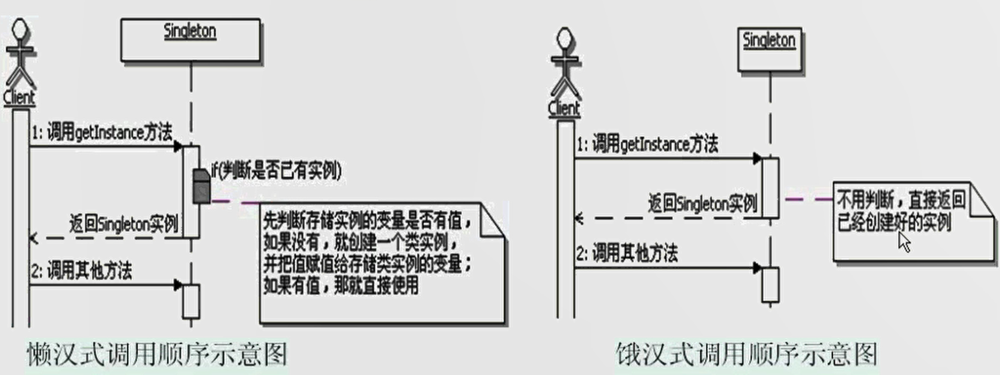

# 单例模式
```
定义：
    保证一个类仅有一个实例，并提供一个访问它的全局访问点。

单例模式的功能：
    用来保证这个类在运行期间只会被创建一个类实例，并提供一个全局唯一访问这个类实例的访问点
单例模式的范围是一个ClassLoader及其子ClassLoader的范围
单例模式的命名：
    一般建议单例模式的方法命名为：getInstance()

懒汉式单例模式的线程不安全，所以需要加锁，饿汉式的线程安全，但空间浪费。

单例模式调用顺序示意图：


延迟加载的思想：
    一开始不要加载资源或书记，等到马上要使用了才去加载，所以称为Lazy Load，可以节约资源。
缓存的思想：
    某些资源或数据会被频繁的使用，可以把这些数据缓存到内存中，每次操作的时候，先到内存中找，从而节省大量的时间。
    当然，缓存是典型的时间换空间的方案。

单例模式的优缺点
    1、时间和空间：懒汉式是典型的时间换空间，饿汉式是典型的空间换时间
    2、线程安全：
        （1）不加同步的懒汉式是线程不安全的
        （2）饿汉式是线程安全的，因为虚拟机保证了只会装载一次
        （3）懒汉式线程安全可以使用synchronized
        （4）双重检查加锁
                因为不是每次进入getInstance方法都需要同步，而是先不同步，进入方法过后，先检查实例是否存在。
            然后不存在才进入下面的同步块，这是第一重检查。
            进入同步块后，再次检查实例是否存在，如果不存在，就在同步的情况下创建一个实例，这是第二重检查。
            这样只需要同步一次，从而减少了多次同步情况下进行判断所浪费的时间。
                双重检查加锁记者的实现会使用一个关键字volatile，被它修饰的变量值不会被本地线程缓存，
            所有对该便利的读写都是直接操作共享内存，从而确保多个线程能正确的处理该变量。 
        
Java中更好的实现单例的方式：
    Lazy initialization holder class模式，这个模式综合使用了Java的类级内部类和多线程
    枚举实现：单元素的枚举类型已经成为实现Singleton的最佳方法。

单例模式的本质：控制实例数目

当需要控制一个类的实例只能有一个，而客户只能从一个全局访问点访问它时，可以选用单例模式。


```