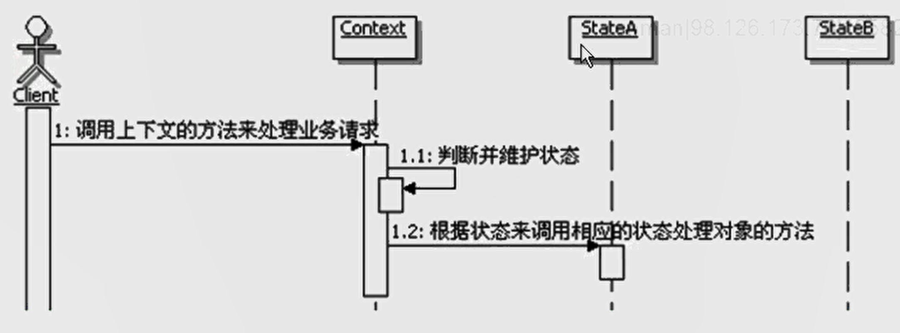
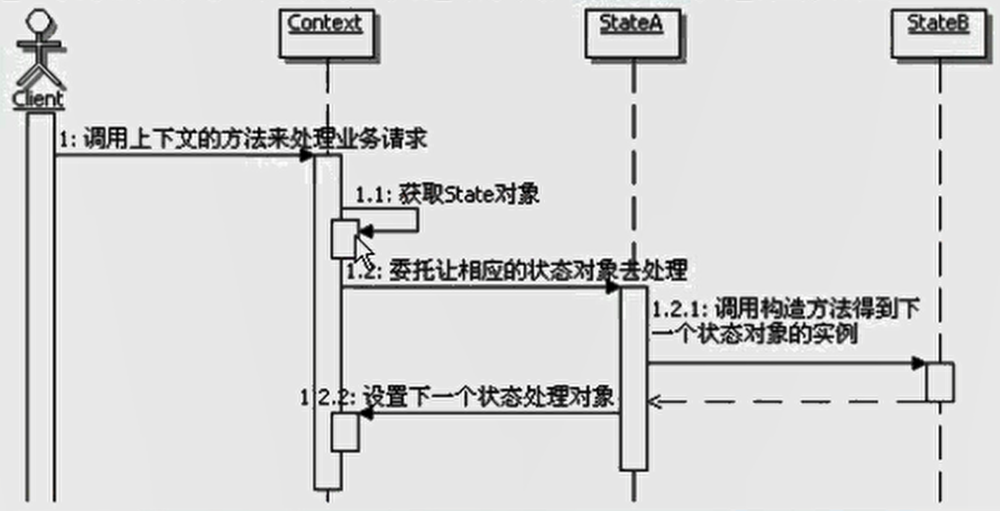

#状态模式
```
定义：
    允许一个对象在其内部状态改变时改变它的行为。对象看起来似乎修改了它的类。
    
状态和行为：
    状态通常指的就是对象实例的属性的值，而行为指的就是对象的功能，再具体点说，行为多半可以对应到方法上。
    状态模式的功能就是分离状态的行为，通过维护状态的变化，来调用不同的状态对应的不同的功能。
    状态和行为是相关联的，关系可描述为：状态决定行为。
    由于状态是在运行期被改变的，因此行为也会在运行期，根据状态的改变而改变，看起来，同一个对象，在不同的运行时刻，行为是不一样的，就像是类被修改了一样。
   
行为的平行性：
    平行性而不是平等性，平行性指的是各个状态的行为所处的层次是一样的，相互是对立的、没有关联的，是根据不同的状态来决定到底走平行线的哪一条，
    行为是不同的，当然对应的实现也是不同的，相互之间不可替代。
    而平等性强调的是可替换性，大家是同一行为的不同描述或实现，因此在同一个行为发生的时候，可以根据条件来挑选任意一个实现来进行相应的处理。
    
 上下文和状态处理对象：
    在状态模式中，上下文是持有状态的对象，但是上下文本身并不处理跟状态相关的行为，
    而是把处理状态的功能委托给了状态对应的状态处理类来处理。
    在具体的状态处理类里面继承需要获取上下文自身的数据，甚至在必要的时候会回调上下文的方法，
    因此，通常将上下文自身当作一个参数传递给具体的状态处理类。
    客户端一般只和上下文交互，可以用一个状态对象来配置一个上下文，一旦配置完毕，就不再需要和状态对象打交道了，
    客户端通常不负责运行期间状态的维护，也不负责决定到底后续使用哪一个具体的状态处理对象。
    
不完美的OCP（开闭模式）体验：
    使用状态模式来修改和扩展功能，是没有完全遵循OCP原则的。由于状态的维护和转换在状态模式的结果里面，
    不管你是扩展了状态实现类，还是添加了状态实现类，都需要修改状态维护和转换的地方，以使用新的实现。
    
创建和销毁状态对象：
    常见的选择有：
        1、应该是当需要使用状态对象的时候创建，使用完后就销毁它们。
        2、另一个是提前创建它们并且始终不销毁
        3、还有一种，采用延迟加载和缓存合用的方式，当第一次需要使用状态对象的时候创建，
        使用完后并不销毁对象，而是把这个对象缓存起来，等待下一次使用，而且在合适的时候，会由缓存框架销毁状态对象。

如何选择状态对象的创建和销毁：
        1、如果要进入的状态在运行时是不可知的，而且上下文是比较稳定的，不会经常改变状态，而且这个使用也不频繁，这个时候建议选用第一种方案。
        2、如果状态改变很频繁，需要频繁创建状态对象，而且在谈对象还存储着大量的信息数据，这种情况建议选择第二种方案。
        3、如果无法确定状态是否频繁，而且有些状态对象的状态数据量大，有些比较小，一切都是未知的，建议选择第三种。
    实际开发中，首选第三种，因为兼顾前两种方案的优点，又避免了缺点，几乎能适应各种情况的需要。但是在实现的时候，需要实现一个合理的缓存框架，
    而且要考虑多线程并发的问题，因为需要由缓存框架来在合适的时候销毁状态对象，因此实现上难度稍高。
    另外在实现中可以考虑结合享元模式，通过享元模式来共享状态对象。

状态模式调用顺序示意图：
    

状态的维护和转换控制：
    状态维护：维护状态的数据，给状态设置不同的状态值
    状态的转换：指的是根据状态的变化来选择不同的状态处理对象。
    通常有两个地方可进行状态的维护和转换控制：
        一个是在上下文中，因为状态本身通常被实现为上下文对象的状态，因此可以在上下文中进行维护，当然也就可以控制状态的转换了。
        另外一个地方就是状态的处理类中，当每个状态处理对象处理完自身状态所对应的功能后，可以根据需要指定后继的状态，以便让应用能够正确处理后续的请求。
        
两种方式的选择：
    1、一般情况下，如果状态转换的规则是一定的，一般不需要进行什么扩展规则，那么就适合在上下文中统一进行状态的维护。
    2、如果状态的转换取决于前一个状态动态处理的结果，或者是依赖于外部数据，为了增强灵活性，这种情况下，一般是在状态处理类里面进行状态的维护。

状态对象来维护和状态转换的调用顺序示意图：
    

使用数据库来维护状态：
    使用数据库维护状态，在数据库中存入下一个状态的识别数据，也就是说维护下一个状态演化成了维护下一个状态的识别数据。
    在程序中，通过查询数据库在的数据得到状态编码，然后再根据状态编码来创建相应的状态对象，然后再委托相应的状态对象进行功能处理。
    直接把”转移“记录到数据库中，这样会更灵活。
        转移：描述从A状态到B状态的那么一个转换变化。

状态模式的优缺点：
    1、简化应用逻辑控制
    2、更好的分离状态和行为
    3、更好的扩展性
    4、显式化进行状态转换
    5、引入太多的状态类

状态模式的本质：根据状态来分离和选择行为

何时选用状态模式：
    1、如果一个对象的行为取决于它的状态，而且它必须在运行时刻根据状态来改变它的行为。可以使用状态模式将状态和行为分开，
    虽然分开了，但状态和行为是有对应关系的，可以在运行期间，通过改变状态，就能够调用到该状态对应的状态处理对象上去，从而改变对象的行为。
    2、一个操作中含有庞大的多分支语句，而且这些分支依赖于该对象的状态，可以使用状态模式，把各个分支的处理分散包装到单独的对象处理类里面，
    这样，这些分支对应的对象就可以不依赖于其他对象而独立变化了。


```
