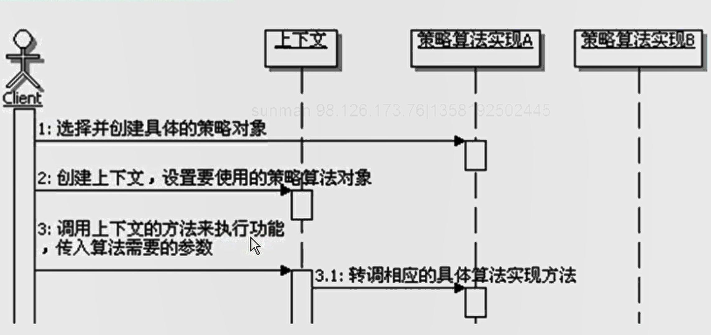

#策略模式
```
定义：
    定义一系列的算法，把它们一个个封装起来，并且使它们可以相互替换。
    本模式使得算法可独立于使用它的客户而变化。
    
策略模式的功能：
    把具体的算法实现从具体的业务处理里面独立出来，实现成为单独的算法类，从而形成一系列的算法，并让这些算法可以相互替换。
    策略模式的重心不是如何来实现算法，而是如何组织、调用这些算法，从而让程序更灵活、具有更好的维护性和扩展性。

策略模式和if else语句
    每个策略算法具体实现的功能，就是原来在if-else结构中的具体实现。
    策略模式 就是把if else中的实现封装到单独的策略实现类了，然后通过上下文与具体的策略类进行交互。
    因此，多个if-else语句可以考虑使用策略模式。

算法的平等性：
    策略模式一个很大的特点就是各个策略算法的平等性。对于一系列具体的策略算法，大家的地位是完全一样的，所以实现算法之间可以相互替换。
    所有的策略算法在实现上也是相互独立的，相互之间是没有依赖的。
    策略算法是相同行为的不同实现。

谁来选择策略算法：
    两个地方可以进行具体的策略选择。
    一个是在客户端，在使用上下文的时候，由客户端来选择具体的策略算法，然后把这个策略算法设置给上下文。
    另一个是由上下文来选择具体的策略算法。

Strategy的实现方式：
    Strategy使用接口来定义是较为常见的方式，但是如果算法具有公共功能的话，可以把Strategy实现为抽象类，然后把公共功能实现到Strategy中。
    
运行时策略的唯一性：
    运行期间，策略模式在每一个时刻只能使用一个具体的策略实现对象，虽然可以动态的在不同的策略实现中切换，但是同时只能使用一个。
    
增加新的策略：
    策略模式可以灵活的扩展新的算法，写一个策略算法类来实现新的要求，然后在客户端使用的时候指定使用新的策略算法类就可以了。
    
策略模式调用顺序图：
    

Context和Strategy的关系
    在策略模式中，通常是上下文使用具体的策略实现对象，反过来，策略实现对象也可以从上下文获取所需要的数据，
    因此可以将上下文当参数传递给策略实现对象，这种情况下上下文和策略实现对象是紧密耦合的。
    这种情况下，上下文封装着具体策略对象进行算法运算所需要的数据，具体策略对象通过回调上下文的方法来获取这些数据。
    甚至在某些情况下，策略实现对象还可以回调上下文的方法来实现一定的功能，上下文变相充当了多个策略算法实现的公共接口，在上下文定义的方法可以当做是所有或者部分策略算法使用的公共功能。
    由于策略对象都实现同一个策略接口，传入同一个上下文，可以会造成传入的上下文数据的浪费。
    因为有些算法会使用这些数据，有些算法不会使用。

两种扩展的实现选择：
    对于扩展上下文的方式：
        所有策略的实现风格更统一，策略需要的数据都统一从上下文来获取，使用方法上也很统一；另外，在上下文中添加新的数据，别的相应算法也可以用得上，可视为公共数据。
        缺点是如果这些数据只有一个特点的算法来使用，那么这些数据有些浪费；另外每次添加新的算法都要去扩展上下文，容易形成复杂的上下文对象层次，也未见的有必要。
    对于在策略算法的实现上添加自己需要的数据的方式扩展：
        实现简单，但跟其他策略实现的风格不一致，其他策略都是从上下文中来获取数据，而这个策略一部分来自上下文，一部分数据来自自己，有些不统一；
        另外，这样一来，外部使用这些策略算法的时候也不一样了，不太好以一个统一的方式来动态切换策略算法。

另一种策略模式调用顺序示意图：
    策略模式调用的另一种情况就是把Context当作参数来传递给Strategy，调用顺序如下图：
    

容错恢复机制：
    程序运行的时候，正常情况下应该按照某种方式来做，如果按照某种方式来做发生错误，
    系统不会崩溃，也不会就此不能继续向下运行，而是有容忍出错的能力，不但能容忍程序运行出现错误，
    还能提供出现错误后的备用方案，也就是恢复机制，来代替正常执行的功能，使程序继续向下运行。
    
策略模式结合模板方法模式：
    实际应用策略模式的过程中，经常会出现一系列算法的实现存在公共功能，甚至这一系列算法的实现步骤都是一样的，只是在某些局部步骤上有所不同，需要对策略模式进行变化使用。
    对于一系列算法的实现存在公共功能的情况下，策略模式可以有如下三种实现方式:
        1、在上下文当中实现公共功能，让所有具体的策略算法回调这些方法。
        2、把策略的接口改成抽象类，然后在里面实现具体算法的公共功能。
        3、为所有的策略算法定义一个抽象的父类，让这个父类去实现策略的接口，然后在这个父类里面去实现公共的功能。
            进一步，“一系列算法的实现步骤相同，某些局部步骤不同”的情况，可以在这个抽象类里面定义算法实现的骨架，然后让具体的策略算法去实现变化的部分。
            这样的一个结构自然就变成了策略模式来结合模板方法模式了，这个抽象类就成了模板方法模式的模板类。
            
策略模式的优缺点：
    1、定义一系列算法
    2、避免多重条件语句
    3、更好的扩展性
    4、客户必须了解各种策略的不同
    5、增加了对象的数目
    6、只适合扁平的算法结构

策略模式的本质：分离算法，选择实现

对设计原则的体现：很好的体现了开闭原则和里氏替换原则。

何时选用策略模式：
    1、出现有许多相关的类，仅仅是行为有差别的情况，可以使用策略模式来使用多个行为中的一个来配置一个类的方法，实现算法的动态切换。
    2、出现同一个算法，有很多不同的实现的情况，可以使用策略模式来把这些“不同的实现”实现成为一个算法的类层次。
    3、需要封装算法中，与算法相关的数据的情况，可以使用策略模式来避免暴露这些跟算法相关的数据结构。
    4、出现抽象一个定义了很多行为的类，并且是通过多个if-else语句来选择这些行为的情况，可以使用策略模式来替代这些条件语句。


```


