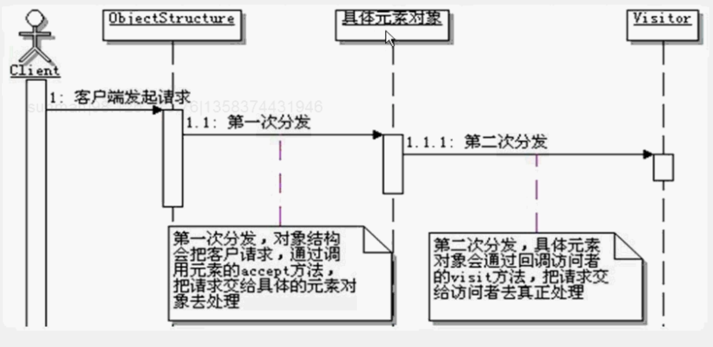

# 访问者模式

```
定义：
    表示一个作用于某对象结构中的各元素的操作。
    它使你可以在不改变各元素的类的前提下定义作用于这些元素的新操作。
    
访问者的功能：
    访问者模式能给一系列对象，透明的添加新功能。
    从而避免在维护期间，对这一系列对象进行修改，而且还能变相实现复用访问者所具有的功能。
    由于是针对一系列对象的操作，也导致，如果只想给一系列对象中的部分对象添加功能，就会有些麻烦；
    而且要始终能保证把这一系列对象都要调用到，不管是循环还是递归，总之要让每个对象都被访问到。
    
调用通路：
    访问者之所以能实现“为一系列对象透明的添加新功能”的重要原因是依靠通用方法。
    访问者需要访问对象，就提供一个访问的方法，如visit方法；
    被访问对象需要接受访问者的访问，使用提供一个接受访问的方法，如accept方法。
    这两个方法并不代表任何具体的功能，只是构成一个调用的通路。
    真正的功能实现是在accept方法里面回调visit的方法，从而回调到访问者的具体实现上，
    而这个访问者的具体实现的方法才是要添加的新的功能。
    
两次分发技术：
    访问者模式能够实现在不改变对象结构的情况下，就能给对象结构中的类增加功能，实现这个效果所使用的核心技术就是两次分发的技术。
    在访问者模式中，当客户端调用ObjectStructure的时候，会遍历ObjectStructure中的所有元素，调用这些元素的accept方法，让这些元素来接受访问，
    这是请求的第一次分发；在具体的元素对象中实现accept方法的时候，会回调访问者的visit方法，等于请求被第二次分发了，请求被分发给访问者来进行处理，
    真正实现功能的正式访问者的visit方法。
    两次分发的调用过程：
        
    两次分发技术使得客户端的请求不再被静态的绑定在元素对象上，这个时候真正执行什么样的功能同时取决于访问者类型和元素类型，
    就算是同一种元素类型，只要访问者类型不一样，最终执行的功能也不会一样，这样一来，就可以在元素对象不变的情况下，
    通过改变访问者的类型，来改变真正执行的功能。
    两次分发技术还有一个优点，就是可以在程序运行期间进行动态的功能组装和切换，
    只需要在客户端调用时，组合使用不同的访问者对象实例即可。
    Java的回调技术也有点类似于两次分发技术，客户端调用某分发，这个分发就类似于accept方法，传入一个接口的实现对象，
    这个接口的实现对象就有点像是访问者，在方法内部，会回调这个接口的方法，就类似于调用访问者的visit方法，
    最终执行的还是接口的具体实现里面实现的功能。

visit方法不可以放在被访问者对象的父类中，因为需要传入this参数，就无法访问子类的一些数据和方法。

空的访问方法
    并不是所有的访问方法都需要实现，由于访问者模式默认的是访问对象结构中的所有元素，因此在实现某些功能的时候，
    如果不需要涉及到某些元素的访问方法，这些方法可以实现成为空的。

操作组合对象结构：
    组合模式构建的组合对象结构，对外有一个统一的外观，想要添加新的功能只要在组件的接口上定义新的功能就可以了，麻烦的是这样一来，需要修改所有的子类。
    为了让组合对象结构更灵活、更容易维护和更好的扩展性，可以改造成访问者模式和组合模式结合来实现。
    访问者模式和组合模式组合使用的思路：
        首先把组合对象结构中的功能方法分离出来，虽然维护组合对象结构的方法也可以分离出来，但是为了维持组合对象结构本身，
        这些方法还是放在组合对象结构里面，然后把这些功能方法分别实现成为访问者对象，通过访问者模式添加到组合的对象结构中去。
        
谁负责遍历所有元素对象：
    在访问者模式中，访问者必须要能够访问到对象结构中的每个对象，因为访问者要为每个对象添加功能，为此特别在模式中定义出一个objectStructure来，
    然后由ObjectStructure来负责遍历访问一系列对象中的每个对象。
    在ObjectStructure迭代所有的元素时，又分成两种情况。
        （1）一种的元素的对象结构是通过集合来组织的，那么直接在ObjectStucture中对集合进行迭代，对每一个元素调用accept就好了。
        （2）另一种情况是元素的对象结构是通过组合模式来组装的，提出可以构成对象属，这种情况一般就不需要在ObjectStructure中迭代了，
        而通常的做法是在组合对象的accept方法里面，递归遍历它的子元素，然后调用子元素的accept方法。
    不需要ObjectStrycture的时候
        当只有一个被访问对象的时候就可以不需要ObjectStructure对象，只要调用这个对象就好了。
        还有当访问组合对象结构，从客户端的角度看，它访问的缺省就是一个对象，也可以去掉ObjectStructure，
        然后直接从客户端调用元素的accept方法。
    有些时候，遍历元素的方法也可以放到访问者中去，当然也是需要递归遍历它的子元素的，
    出现这种情况的主要原因是：想在访问者中实现特别复杂的遍历，访问者的实现依赖于对象结构的操作结果。
    
访问者模式的优缺点：
    1、好的扩展性
    2、好的复用性
    3、分离无关行为
    4、对象结构变化很困难
    5、破坏封装

访问者模式的本质：预留通路，回调实现
     
何时选用：
    1、如果想对一个对象结构，实施一些一来于对象结构中的具体类的操作，可以使用访问者模式。
    2、如果想对一个对象结构中的各个元素，进行很多不同的而且不相关的操作，为了避免这些操作使得类变得杂乱，可以使用访问者模式，
    把这些操作分散到不同的访问者对象中去，每个访问者对象实现同一类功能。
    3、如果对象结构很少变得，但是需要经常给对象结构中的元素对象定义新的操作，可以使用访问者模式。
    
    


```